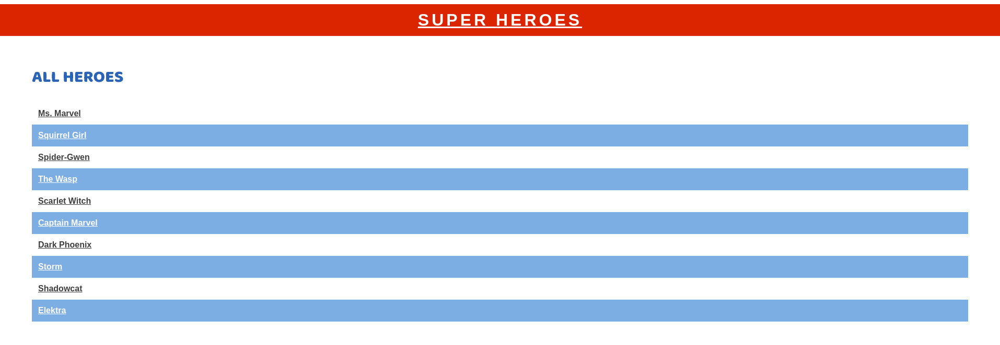

# Superheroes

A simple React-Flask fullstack webapp for tracking heroes and their superpowers.



## Features

- View all superheroes and their powers
- Update a superhero's powers
- Post new superhero powers

## Setup

### 1. Clone the repository

```txt
git clone https://github.com/ArshavineRoy/superheroes
```

### 2. Navigate to the project's directory

```txt
cd superheroes
```

### 3. Install required dependencies

```python
pipenv install

npm install --prefix client
```

### 4. Activate the virtual environment for the Flask app

```python
pipenv shell
```

### 5. If needed, run migrations and seed the database

```python
flask db upgrade head

python app/seed.py
```

#### NOTE: All queries are made to a deployed PostgreSQL database

### 6. Run the Flask server

You can run the Flask API on [`localhost:5555`](http://localhost:5555) by running:

```sh
python app/app.py
```

### 7. In another terminal, run the React client from the root

You can run your React app on [`localhost:4000`](http://localhost:4000) by running:

```sh
npm start --prefix client
```

## API Usage

### GET /heroes

Returns JSON data in the format below:

```json
[
  { "id": 1, "name": "Kamala Khan", "super_name": "Ms. Marvel" },
  { "id": 2, "name": "Doreen Green", "super_name": "Squirrel Girl" },
  { "id": 3, "name": "Gwen Stacy", "super_name": "Spider-Gwen" }
]
```

### GET /heroes/:id

If the `Hero` exists, returns JSON data in the format below:

```json
{
  "id": 1,
  "name": "Kamala Khan",
  "super_name": "Ms. Marvel",
  "powers": [
    {
      "id": 1,
      "name": "super strength",
      "description": "gives the wielder super-human strengths"
    },
    {
      "id": 2,
      "name": "flight",
      "description": "gives the wielder the ability to fly through the skies at supersonic speed"
    }
  ]
}
```

If the `Hero` does not exist, returns the following JSON data:

```json
{
  "error": "Hero not found"
}
```

### GET /powers

Returns JSON data in the format below:

```json
[
  {
    "id": 1,
    "name": "super strength",
    "description": "gives the wielder super-human strengths"
  },
  {
    "id": 1,
    "name": "flight",
    "description": "gives the wielder the ability to fly through the skies at supersonic speed"
  }
]
```

### GET /powers/:id

If the `Power` exists, returns JSON data in the format below:

```json
{
  "id": 1,
  "name": "super strength",
  "description": "gives the wielder super-human strengths"
}
```

If the `Power` does not exist, returns the following JSON data:

```json
{
  "error": "Power not found"
}
```

### PATCH /powers/:id

This route updates an existing `Power`. Accepts an object with
the following properties in the body of the request:

```json
{
  "description": "Updated description"
}
```

If the `Power` exists and is updated successfully (passes validations), it updates
its description and returns JSON data in the format below:

```json
{
  "id": 1,
  "name": "super strength",
  "description": "Updated description"
}
```

If the `Power` does not exist, returns the following JSON data:

```json
{
  "error": "Power not found"
}
```

If the `Power` is **not** updated successfully, returns the following JSON data:

```json
{
  "errors": ["validation errors"]
}
```

### POST /hero_powers

This route creates a new `HeroPower` associated with an
existing `Power` and `Hero`. Accepts an object with the following
properties in the body of the request:

```json
{
  "strength": "Average",
  "power_id": 1,
  "hero_id": 3
}
```

If the `HeroPower` is created successfully, it sends back a response with the data
related to the `Hero`:

```json
{
  "id": 1,
  "name": "Kamala Khan",
  "super_name": "Ms. Marvel",
  "powers": [
    {
      "id": 1,
      "name": "super strength",
      "description": "gives the wielder super-human strengths"
    },
    {
      "id": 2,
      "name": "flight",
      "description": "gives the wielder the ability to fly through the skies at supersonic speed"
    }
  ]
}
```

If the `HeroPower` is **not** created successfully, it returns the following
JSON data:

```json
{
  "errors": ["validation errors"]
}
```

## Author & License

Authored by [Arshavine Waema](https://github.com/ArshavineRoy).

Licensed under the [MIT License](LICENSE) - see the [LICENSE](LICENSE) file for details.
